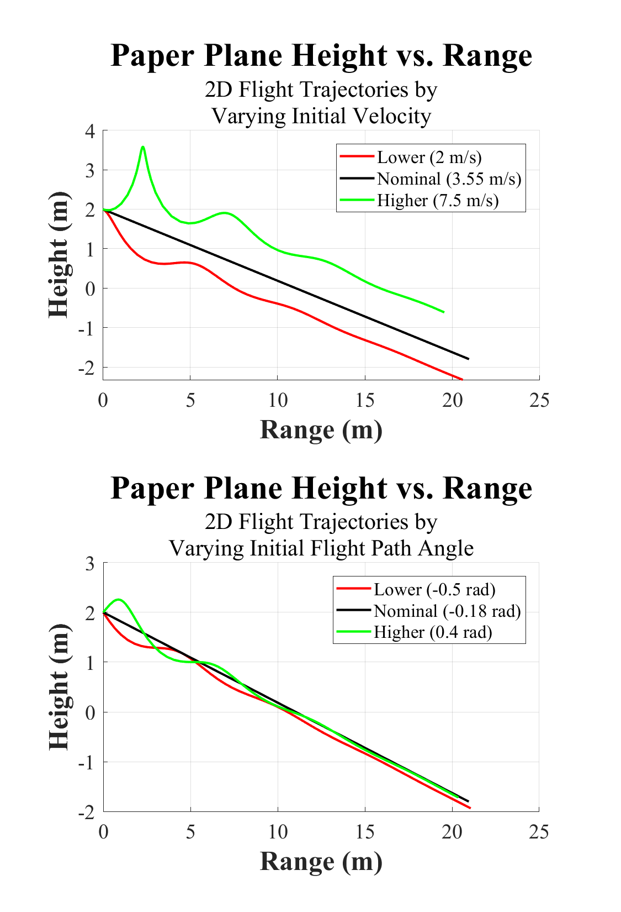

# Paper Airplane Numerical Study
## Final Project: AEM 3103 Spring 2024

 By: Monica Robles

## Summary of Findings

  The purpose of this study was to analyze the effects of varying initial velocity and flight path angle parameters on a glider's 2D flight trajectory. This was first done by varying the initial parameters over their minimum, nominal, and maximum values which are shown in the table below, and the resulting flight trajectories can be seen in Figure 1. The inital parameters were then randomized and used to generate 100 2D flight trajectories, as seen in Figure 2. A 10th order polynomial fit was applied to display the average of these trajectories. Finally, the time derivatives of the average tragectory's height and range were calculated, and plotted over time, as seen in Figure 3. 
  
  Overall, the trajectories displayed a consistent maximum range, and showed greater variations in height. When varying the initial velocity, the flight trajectory deviated more greatly from the nomial value when compared to those of the varied initial flight path angle, who's trajectories converged to about the same path toward the end of the flight. These results indicate that the initial veloctiy at which the glider is launched at has a greater effect on its flight trajectory than its initial flight path angle. The average trajectory displays a curve that is similar in shape to the curves produced by the nominal initial paramters in Figure 1. 

| Initial Variable Varied | Minimum Value | Nominal Value | Maximum Value |
|-------------------------|---------------|---------------|---------------|
| Velocity (m/s)          |       2       |      3.55     |      7.5      |
| Flight Path Angle (rad) |     -0.5      |     -0.18     |      0.4      |
 
# Code Listing
  A list of each function/script and their descriptions. Each name of the function/script links to the file in this GitHub repository. 

  - [PaperPlane.m](PaperPlane.m)
    - Script that contains code for all paper plane flight trajectory simulation calculations and their respective figures. 
  - [setup_sim.m](setup_sim.m)
    - Function that contains constant variables and flight mechanics equations need for flight trajectory simulations. 
  - [EqMotion.m](EqMotion.m)
    - Function containing 4th order equations of the aircraft's motion. 
  - [central_der.m](central_der.m)
    - Function that contains the central finite difference approximation equation used for taking time derivatives of the average trajectory. 

# Figures

## Fig. 1: Single Parameter Variation
  

  Figure of 2D flight trajectories simulated by varying the initial velocity (first subplot) and initial flight path angle (second subplot) over their minimum, nominal, and maximum values.  

## Fig. 2: Monte Carlo Simulation
  

  Figure of 2D trajectories simulated using random initial velocity and initial flight path angle values. The plot also contains a 10th order polynomial fit that averages all 100 trajectories. 

## Fig. 3: Time Derivatives
  

  Figure of average 2D trajectory time derivative of height versus time (first subplot) and time derivative of range versus time (second subplot).