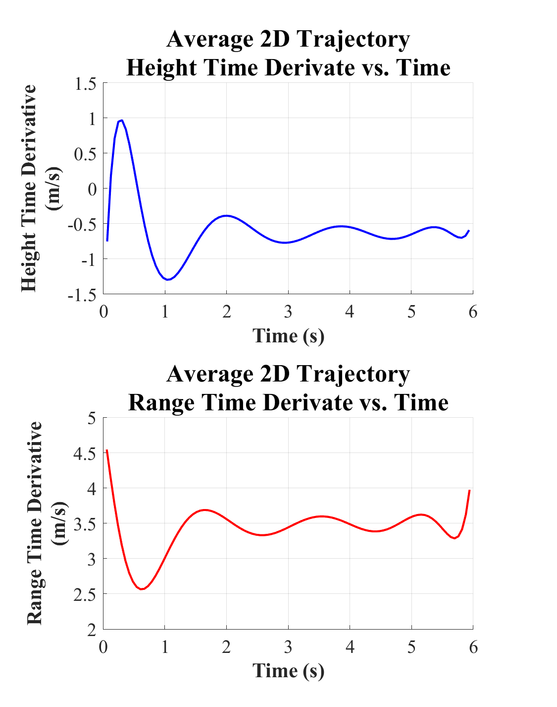

# Paper Airplane Numerical Study
## Final Project: AEM 3103 Spring 2024

  - By: Monica Robles

## Summary of Findings

| Initial Variable Varied | Minimum Value | Nominal Value | Maximum Value |
|-------------------------|---------------|---------------|---------------|
| Velocity (m/s)          |       2       |      3.55     |      7.5      |
| Flight Path Angle (rad) |     -0.5      |     -0.18     |      0.4      |

  Summarized what was accomplished in this study.  Describe 2-4 observations from simulating the flight path.
  Reference the figures below as needed.

  *If the analysis falls short of the goal, this is your chance to explain what was done or what were the barriers.*
 
# Code Listing
  A list of each function/script and a single-line description of what it does. Each name of the function/script links to the file in the GitHub repository.

  - [PaperPlane.m](PaperPlane.m)
    - Scprit that contains code for all paper plane flight trajectory simulation calculations and respective figures. 
  - [setup_sim.m](setup_sim.m)
    - Function that contains constant variables and flight mechanics equations need for flight trajectory simulations. 
  - [EqMotion.m](EqMotion.m)
    - Function containing 4th order equations of the aircraft's motion. 
  - [central_der.m](central_der.m)
    - Function that contains central finite difference approximation equation used for taking time derivatives for average trajectory. 

# Figures

## Fig. 1: Single Parameter Variation
  

  Figure of 2D flight trajectories simulated by varying the initial velocity (first subplot) and initial flight path angle (second subplot). 

## Fig. 2: Monte Carlo Simulation
  

  Figure of 2D trajectories simulated using random initial velocity and initial flight path angle values. The plot also contains a 10th order polynomial fit that averages all 100 trajectories. 

## Fig. 3: Time Derivatives
  

  Figure of average 2D trajectory time derivative of height versus time (first subplot) and time derivative of range versus time (second subplot).